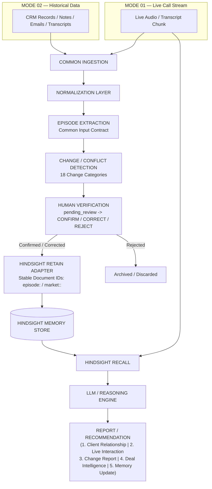

# DEAL INTELLIGENCE AGENT - DATA PIPELINE ARCHITECTURE

An AI sales memory architecture designed to learn from previous sales experiences using **Hindsight Memory**.

This repository implements the production-quality Python Data Pipeline supporting **Mode 01 (Live Call Intelligence)**, **Mode 02 (Provided/Historical Data Ingestion)**, **Mode 02-B (Post-Meeting Change Detection)**, and a **Common Hindsight Input Contract**.

---

## 1. System Architecture



---

## 2. Directory Structure

```
deal_intelligence/
│
├── app/
│   ├── ingestion/             # File loaders & LoaderRegistry
│   │   ├── base.py
│   │   ├── json_loader.py
│   │   ├── csv_loader.py
│   │   ├── text_loader.py
│   │   └── registry.py
│   │
│   ├── normalization/         # Standardization and cleaning
│   │   ├── normalizer.py
│   │   ├── field_mapper.py
│   │   └── cleaners.py
│   │
│   ├── validation/            # Validation engine & conflict detection
│   │   ├── schema.py
│   │   └── validator.py
│   │
│   ├── extraction/            # Episode & Lesson extraction
│   │   ├── episode_extractor.py # Extraction vs Causal confidence separation
│   │   ├── memory_classifier.py
│   │   └── lesson_extractor.py
│   │
│   ├── verification/          # Human review workflow & audit log
│   │   ├── verification_service.py
│   │   └── verification_models.py
│   │
│   ├── hindsight/             # Hindsight Memory Adapter
│   │   ├── client.py          # Retain, recall, health check
│   │   ├── retain.py          # Narrative generator ([EPISODE], [MARKET_FACT])
│   │   ├── recall.py
│   │   └── memory_manager.py  # Stable document IDs & market versioning
│   │
│   ├── models/                # Core Pydantic models
│   │   ├── raw_data.py
│   │   ├── normalized_data.py
│   │   ├── episode.py         # Common Hindsight Contract schema
│   │   ├── market_info.py
│   │   ├── live_interaction.py# Mode 01 streaming models
│   │   ├── change_event.py    # Mode 02-B change models (18 categories)
│   │   └── memory.py
│   │
│   ├── services/              # Pipeline services
│   │   ├── pipeline.py        # Master pipeline orchestrator
│   │   ├── live_intelligence_service.py # Mode 01 Live call service
│   │   ├── change_detection_service.py # Mode 02-B Change detector
│   │   ├── report_generator.py # 5 Report types generator
│   │   └── traceability.py    # End-to-end source tracer
│   │
│   └── api/                   # REST API routes (FastAPI)
│       └── routes.py
│
├── config/
│   └── settings.py
│
├── data/
│   ├── raw/
│   ├── normalized/
│   ├── episodes/
│   ├── pending_review/
│   └── confirmed/
│
├── tests/
│   ├── test_pipeline.py       # Core pipeline test suite (15 tests)
│   └── test_extended_pipeline.py # Extended modes & reports test suite (4 tests)
│
├── requirements.txt
├── main.py                    # CLI interface
└── README.md
```

---

## 3. Key Operating Modes & Common Contract

### Mode 01 — Live Interaction Intelligence
Ingests live transcript streams (`LiveTranscriptChunk`). Real-time extraction of live signals (`customer_concerns`, `competitors_mentioned`, `pricing_discussed`, `tactics`).
Triggers **real-time Hindsight Recall** during the call to compare past experiences against current live evidence (preventing outdated recommendation errors).

### Mode 02 — Provided / Historical Data
Ingests CRM records, call transcripts, emails, meeting notes, proposals, and market data files via `LoaderRegistry`.

### Mode 02-B — Post-Meeting Change Detection
Compares baseline `ClientState` with new interactions to detect 18 categories of changes (e.g. competitor pricing drops, stakeholder changes, tool migrations).
Changes produce `ChangeEvent` items in `pending_review` status. **Old memories are never automatically overwritten** until human confirmation.

### Common Hindsight Contract
Both Mode 01 and Mode 02 normalize into the exact same canonical `Episode` contract:
`situation`, `objection`, `tactic`, `customer_reaction`, `outcome`, `why`, `lesson`, `applies_when`, `did_not_hold_when`, `pricing_context`, `timestamp`, `valid_as_of`, `source_ids`, `extraction_confidence`, `causal_confidence`, `verification_status`.

---

## 4. Supported Report Types

1. **Client Relationship Report**: Summary of customer context, stakeholders, interactions, goals, pain points, objections, competitors, pricing, commitments, open issues.
2. **Live Interaction Report**: Real-time call summary, extracted signals, Hindsight recall matches, and live tactical recommendations.
3. **Post-Meeting Change Report**: Summary of detected shifts across the 18 change categories.
4. **Deal Intelligence Report**: Combines historical experiences + current evidence + risks + unresolved issues + contextual tactical analysis.
5. **Memory Update Report**: Details proposed items for Hindsight RETAIN with confidence metrics and justifications.

---

## 5. Running Tests & CLI

### Running All Pytest Scenarios
```bash
python3 -m pytest tests/ -v
```
Runs 19 total scenario tests (100% pass rate).

### CLI Commands

1. **Live Call Mode (Mode 01)**:
   ```bash
   python3 main.py live --session-id call-001 --speaker Customer --text "Competitor X is offering a cheaper quote." --finalize
   ```

2. **Historical Ingestion (Mode 02)**:
   ```bash
   python3 main.py ingest --file data/raw/sample.json
   ```

3. **Generate Reports**:
   ```bash
   python3 main.py report --type client_relationship
   ```

4. **Human Verification**:
   ```bash
   python3 main.py review --episode-id ep_12345 --action confirm
   ```

5. **Trace Lineage**:
   ```bash
   python3 main.py trace --episode-id ep_12345
   ```
# microsoft_hackathon
